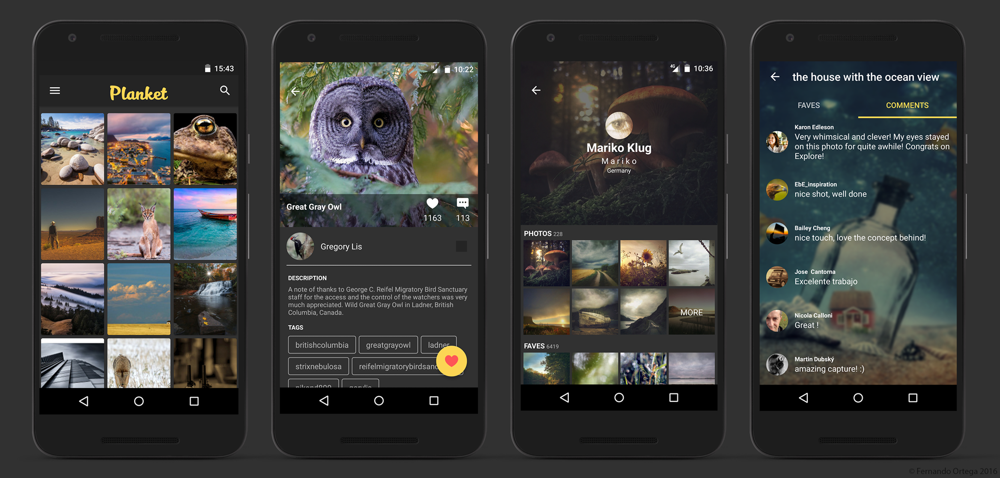

[](https://circleci.com/gh/FernandoOrtegaMartinez/Planket)

# Planket
Planket is an unofficial Flickr client for Android using MVP, Dagger 2 and RxJava among other open source libraries.

[](https://play.google.com/store/apps/details?id=com.fomdeveloper.planket)

## Screenshots
<p align="center">
    
</p>

## Setup
In order to use and compile the project, you'll need to add your own *API key* and *Consumer secret key* to your gradle.properties file:
```
###############################################################################
# App variables.
###############################################################################

flickrApiKey = YOUR_FLICKR_API_KEY
flickrConsumerSecret = YOUR_CONSUMER_SECRET
```
## Features

Currently the application allows you to:

- Browse photos from the Interestingness feed.
- Log in to your Flickr account.
- Fav/Unfav photos.
- See photos' favs and comments.
- See users profile.
- Search on Flickr.

## Third party dependencies

- RxJava
- Dagger 2
- Retrofit 2
- Okhttp
- Butterknife
- Picasso
- Realm
- Parceler
- Timber
- Espresso
- Mockito
- Android support library

## Developed by
[Fernando Ortega Martinez](https://github.com/FernandoOrtegaMartinez) - fomdeveloper@gmail.com

## Contributing
There are a lot to do yet and PR are always welcome!
If you find something wrong, please report it as an issue.
If you think you can improve something or add a new feature, fork the repo and make a pull request against my develop branch.

## License
Please check the [license](https://github.com/FernandoOrtegaMartinez/Planket/blob/master/LICENSE) file.
